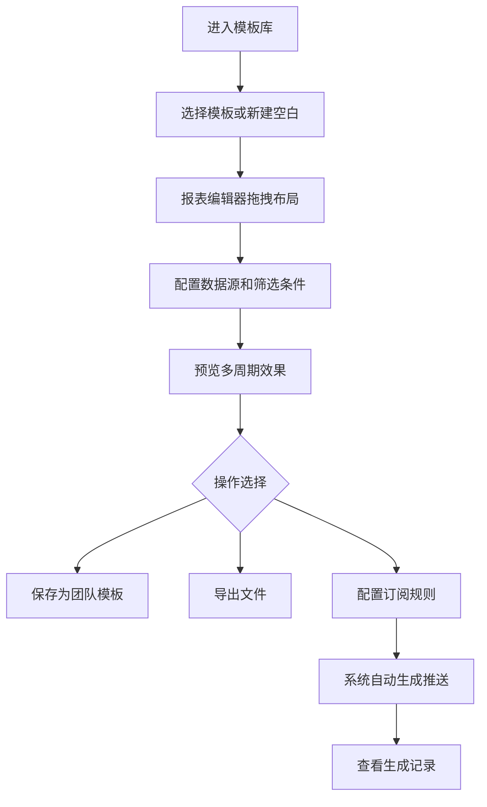

## 1. 产品概述

数据报表生成器是一款面向企业运营、销售和管理人员的自助式报表工具，帮助用户无需技术背景即可快速生成专业数据报表。

- 解决的问题：传统报表依赖技术团队开发，周期长、灵活度低，无法满足业务人员快速分析数据的需求
- 目标用户：运营人员、销售经理、部门主管、数据分析师
- 产品价值：降低报表生成门槛，提高数据决策效率，实现报表全生命周期管理

## 2. 核心功能

### 2.1 用户角色

| 角色 | 核心权限 |
|------|----------|
| 运营人员 | 创建报表、使用模板、导出数据、查看生成记录 |
| 销售经理 | 创建销售报表、配置订阅、管理团队模板 |
| 管理人员 | 查看所有报表、审批模板、管理订阅配置 |
| 系统管理员 | 模板库管理、用户权限配置、系统设置 |

### 2.2 功能模块

1. **模板库页面**：浏览系统模板和团队模板，选择模板或创建空白报表
2. **报表编辑页面**：拖拽式可视化编辑，支持表格、折线图、柱状图、说明文字
3. **数据选择页面**：选择数据源、设置筛选条件、字段排序、汇总方式配置
4. **预览发布页面**：多时间周期预览、保存为模板、导出文件、发布报表
5. **订阅管理页面**：配置日报/周报/月报订阅、指定接收人、查看生成记录

### 2.3 页面详情

| 页面名称 | 模块名称 | 功能描述 |
|-----------|-------------|---------------------|
| 模板库 | 模板分类筛选 | 按行业、场景、类型筛选模板 |
| 模板库 | 模板卡片展示 | 展示模板预览图、名称、描述、使用次数 |
| 模板库 | 新建入口 | 创建空白报表或从模板创建 |
| 报表编辑 | 组件工具栏 | 可拖拽组件：表格、折线图、柱状图、说明文字 |
| 报表编辑 | 画布区域 | 组件拖拽放置、调整大小、移动位置 |
| 报表编辑 | 属性配置 | 选中组件的样式、标题、数据字段配置 |
| 数据选择 | 数据源选择 | 选择数据表、连接数据源 |
| 数据选择 | 筛选条件 | 时间范围、维度筛选、数值区间配置 |
| 数据选择 | 字段配置 | 字段排序、汇总方式（求和、平均值、计数等） |
| 预览发布 | 周期预览 | 切换日/周/月/季度视图预览数据效果 |
| 预览发布 | 导出功能 | 支持 PDF、Excel、PNG 格式导出 |
| 预览发布 | 发布管理 | 保存为团队模板、发布报表 |
| 订阅管理 | 订阅配置 | 配置日报、周报、月报订阅规则 |
| 订阅管理 | 接收人管理 | 指定订阅接收人、设置通知方式 |
| 订阅管理 | 生成记录 | 查看每份报表的历史生成记录和状态 |

## 3. 核心流程

用户从模板库选择模板或创建空白报表 → 在编辑器中拖拽组件布局 → 配置数据源和筛选条件 → 预览不同周期效果 → 保存发布或配置订阅 → 系统按周期自动生成报表并推送

## 4. 用户界面设计

### 4.1 设计风格
- **设计基调**：专业数据风格，深蓝主色调，干净克制的商务感
- **主色**：#1e40af（深蓝），代表专业、可靠、数据驱动
- **辅助色**：#3b82f6（亮蓝）用于交互元素，#10b981（翠绿）用于成功状态，#f59e0b（琥珀）用于警告
- **中性色**：#0f172a（深灰背景）、#1e293b（卡片背景）、#94a3b8（辅助文字）、#f1f5f9（主要文字）
- **按钮风格**：微圆角（6px）、微妙阴影、悬停有轻微上浮效果
- **字体**：使用 Space Grotesk 作为标题字体，Inter 作为正文字体，体现现代科技感
- **布局风格**：左侧导航 + 主内容区的经典后台布局，卡片式内容容器
- **图标风格**：使用 Lucide 线性图标，保持统一的 24px 尺寸

### 4.2 页面设计概述

| 页面名称 | 模块名称 | UI 设计要点 |
|-----------|-------------|-------------|
| 模板库 | 模板网格 | 卡片式布局，悬停放大效果，渐变边框高亮 |
| 报表编辑 | 三栏布局 | 左组件库 + 中画布 + 右属性面板，拖拽时有吸附效果 |
| 数据选择 | 表格式配置 | 树形数据结构，筛选条件使用标签式展示 |
| 预览发布 | 周期切换器 | 标签式周期切换，模拟报表实际渲染效果 |
| 订阅管理 | 时间线记录 | 卡片式订阅配置，时间线展示生成历史 |

### 4.3 响应式
- 采用桌面优先设计，主优化 1440px 和 1920px 分辨率
- 最小支持 1280px 宽度，低于此宽度出现横向滚动
- 侧边栏可折叠，适配小屏显示
- 表格组件支持横向滚动查看更多列

### 4.4 交互与动效
- 页面加载：元素渐入动画，从导航到内容依次出现
- 拖拽交互：组件半透明跟随，放置区域高亮提示
- 数据切换：平滑过渡动画，图表数据更新有缓动效果
- 悬停反馈：卡片轻微上浮 + 阴影加深，按钮背景色渐变
- 状态反馈：操作成功/失败使用顶部通知条，自动消失
