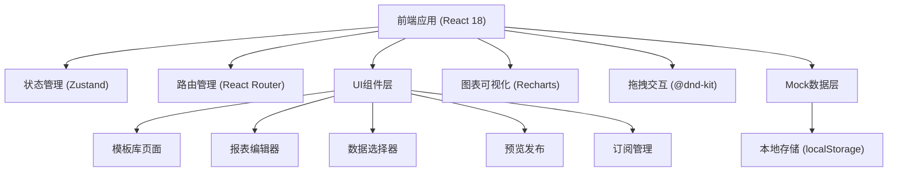
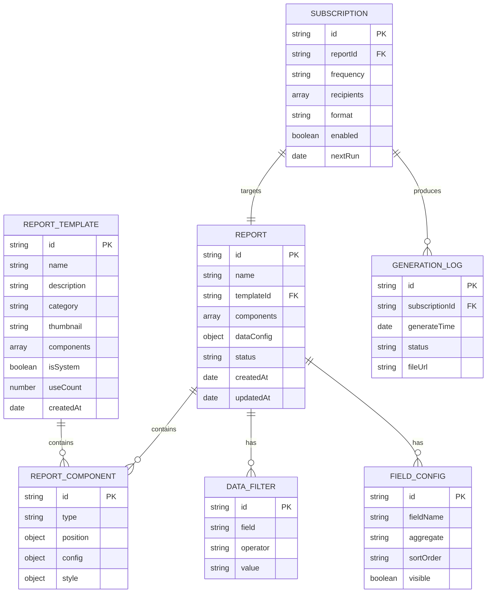

## 1. 架构设计



## 2. 技术描述

- **前端框架**：React@18 + TypeScript + Vite@5
- **样式方案**：TailwindCSS@3.4 + CSS 变量主题系统
- **状态管理**：Zustand@4，集中管理报表、模板、订阅等全局状态
- **路由管理**：React Router DOM@6
- **图表库**：Recharts@2.12，支持折线图、柱状图等多种图表
- **拖拽库**：@dnd-kit/core + @dnd-kit/sortable，实现组件拖拽排序
- **图标库**：lucide-react@0.400，统一图标风格
- **后端**：纯前端实现，使用 Mock 数据和 localStorage 持久化
- **数据存储**：localStorage 存储用户创建的报表、模板和订阅配置

## 3. 路由定义

| 路由路径 | 页面名称 | 功能说明 |
|----------|----------|----------|
| `/` | 模板库 | 首页，浏览和选择报表模板 |
| `/editor` | 报表编辑器 | 拖拽式可视化报表编辑 |
| `/data` | 数据选择 | 数据源配置和筛选条件设置 |
| `/preview` | 预览发布 | 多周期预览和导出发布 |
| `/subscription` | 订阅管理 | 订阅配置和生成记录查看 |

## 4. 目录结构

```
src/
├── components/          # 公共组件
│   ├── layout/         # 布局组件
│   │   ├── Sidebar.tsx
│   │   ├── Header.tsx
│   │   └── Layout.tsx
│   ├── report/         # 报表相关组件
│   │   ├── ReportTable.tsx
│   │   ├── LineChart.tsx
│   │   ├── BarChart.tsx
│   │   └── TextBlock.tsx
│   └── common/         # 通用组件
│       ├── Button.tsx
│       ├── Card.tsx
│       ├── Modal.tsx
│       └── Tabs.tsx
├── pages/              # 页面组件
│   ├── TemplateLibrary.tsx
│   ├── ReportEditor.tsx
│   ├── DataSelector.tsx
│   ├── PreviewPublish.tsx
│   └── SubscriptionManager.tsx
├── store/              # 状态管理
│   └── useReportStore.ts
├── types/              # TypeScript 类型定义
│   └── index.ts
├── data/               # Mock 数据
│   ├── templates.ts
│   ├── mockData.ts
│   └── subscriptions.ts
├── utils/              # 工具函数
│   ├── export.ts       # 导出功能
│   ├── dateUtils.ts    # 日期处理
│   └── dragUtils.ts    # 拖拽工具
├── App.tsx             # 应用入口
├── main.tsx            # React 入口
└── index.css           # 全局样式
```

## 5. 数据模型

### 5.1 数据模型定义



### 5.2 核心类型定义

```typescript
// 报表组件类型
type ComponentType = 'table' | 'lineChart' | 'barChart' | 'text';

interface ReportComponent {
  id: string;
  type: ComponentType;
  position: { x: number; y: number; width: number; height: number };
  config: Record<string, any>;
  style: Record<string, any>;
}

// 报表模板
interface ReportTemplate {
  id: string;
  name: string;
  description: string;
  category: 'sales' | 'operation' | 'finance' | 'marketing';
  thumbnail: string;
  components: ReportComponent[];
  isSystem: boolean;
  useCount: number;
  createdAt: string;
}

// 报表实例
interface Report {
  id: string;
  name: string;
  templateId?: string;
  components: ReportComponent[];
  dataConfig: {
    dataSource: string;
    filters: DataFilter[];
    fields: FieldConfig[];
    dateRange: { start: string; end: string };
  };
  status: 'draft' | 'published';
  createdAt: string;
  updatedAt: string;
}

// 数据筛选
interface DataFilter {
  id: string;
  field: string;
  operator: 'eq' | 'ne' | 'gt' | 'lt' | 'between' | 'in' | 'contains';
  value: any;
}

// 字段配置
interface FieldConfig {
  id: string;
  fieldName: string;
  displayName: string;
  aggregate: 'sum' | 'avg' | 'count' | 'max' | 'min' | 'none';
  sortOrder: 'asc' | 'desc' | 'none';
  visible: boolean;
}

// 订阅配置
interface Subscription {
  id: string;
  reportId: string;
  reportName: string;
  frequency: 'daily' | 'weekly' | 'monthly';
  recipients: { name: string; email: string }[];
  format: 'pdf' | 'excel' | 'png';
  enabled: boolean;
  nextRun: string;
  createdAt: string;
}

// 生成记录
interface GenerationLog {
  id: string;
  subscriptionId: string;
  reportName: string;
  generateTime: string;
  status: 'success' | 'failed' | 'pending';
  format: string;
  fileUrl: string;
  errorMessage?: string;
}
```

## 6. 状态管理设计

Zustand Store 分为以下几个状态切片：

```typescript
interface ReportStore {
  // 模板状态
  templates: ReportTemplate[];
  currentTemplate: ReportTemplate | null;
  
  // 报表状态
  currentReport: Report | null;
  selectedComponentId: string | null;
  
  // 订阅状态
  subscriptions: Subscription[];
  generationLogs: GenerationLog[];
  
  // 操作方法
  setCurrentTemplate: (template: ReportTemplate | null) => void;
  createReportFromTemplate: (templateId: string) => Report;
  createBlankReport: () => Report;
  addComponent: (component: ReportComponent) => void;
  updateComponent: (id: string, updates: Partial<ReportComponent>) => void;
  removeComponent: (id: string) => void;
  selectComponent: (id: string | null) => void;
  updateDataConfig: (config: Partial<Report['dataConfig']>) => void;
  saveReport: () => void;
  addSubscription: (subscription: Omit<Subscription, 'id' | 'createdAt'>) => void;
  toggleSubscription: (id: string) => void;
  deleteSubscription: (id: string) => void;
}
```
